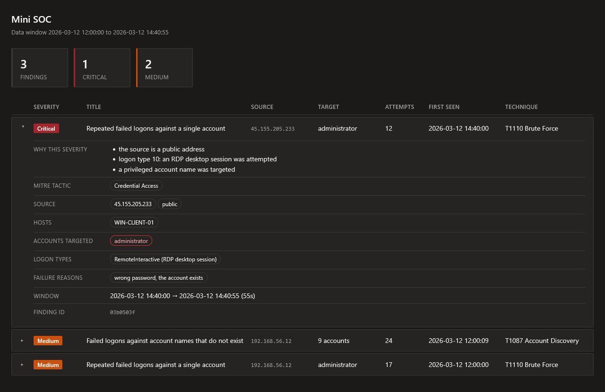

# Mini SOC

Turns raw Windows authentication events into scored, MITRE-mapped findings,
has a local language model triage each one, and renders the result as an HTML
dashboard.

Pure Python standard library. No packages to install, no API key, and nothing
leaves the machine.

```
collect  ->  detect  ->  enrich  ->  agent  ->  dashboard
```

| Stage | What it does |
|---|---|
| `collect` | Produces the raw 4624 / 4625 events the pipeline reads |
| `detect` | Correlates failed logons into findings, and decides which technique each one is |
| `enrich` | Adds what the log line does not say: logon type, failure reason, IP scope, privileged targets, a severity score |
| `agent` | Asks a local model for an assessment and prioritised next steps |
| `dashboard` | Writes a standalone HTML page |

## Running it

```bash
python src/main.py
```

Prints each finding with its severity reasoning and the model's triage note,
then writes `data/dashboard.html`.

Expected output on the bundled dataset:

```
[5] brute_force  45.155.205.233   administrator  12 attempts over 55 seconds
     - the source is a public address
     - logon type 10: an RDP desktop session was attempted
     - a privileged account name was targeted

     ASSESSMENT: ...
     CONFIDENCE: high - ...
     UNKNOWNS: ...
     ACTIONS: ...
```

**Requirements:** Tested with Python 3.14 (older versions untested), and
[Ollama](https://ollama.com) running locally with the model named in
`src/agent.py`:

```bash
ollama pull qwen2.5:32b
```

Ollama is not optional. `main.py` asks the model with every finding, so
without it the run stops at the first one.

## What it detects

Two rules, because one is not enough. Rule 1 keys on `(source, account)` and
therefore cannot see an attacker who moves across accounts. Rule 2 keys on the
source alone and counts accounts instead of attempts.

| Rule | Fires on | Technique |
|---|---|---|
| Brute force | 5+ failures from one source against one account within 5 minutes | T1110 Brute Force |
| Account sweep | one source failing against 4+ distinct accounts within 10 minutes | T1087 Account Discovery **or** T1110.003 Password Spraying |

The sweep rule detects a *pattern*, and two different techniques produce it.
Which one it was is decided from the failure codes rather than hardcoded: a
spray works from a list of accounts the attacker believes are real, so it
cannot produce a "no such user" failure. One of those is proof that names were
being guessed.

Severity is arithmetic, from 1 to 5, so the score can be read back off the
finding. The weights are reasoned estimates, not values derived from real
traffic.

## The dataset

`collect.py` generates a fixed 61-event dataset from a hardcoded seed, so the
expected result is known before the pipeline runs. It is deliberately
adversarial:

- Isolated typos carry the **same event ID and the same failure code** as the
  attack, so filtering on event type alone cannot separate them. Only density
  per source can.
- Two attempts sit hours either side of the brute-force burst. They belong to
  the same group but outside the window, so a parser that groups without
  correlating reports 19 where the correct answer is 17.
- The account sweep uses eight names that do not exist, twice each. Every
  attempt lands in a group of two, far below the brute-force threshold: rule 1
  reports none of it, and rule 2 exists because of it.

`data/` is generated and not tracked. A fresh clone recreates it on first run.

## The dashboard



`data/dashboard.html` is a single file with the stylesheet inlined, so it opens
from disk with no server. It borrows the layout of a SOC console: a count per
severity across the top, then one list of findings sorted worst first.

Severity appears under the names such a console uses rather than as a bare
number, so a 5 reads as Critical and a 1 as Informational. Each row expands in
place to show why the score is what it is, which accounts were targeted and
which of those are privileged, the logon types, and the failure reasons.

## Design notes

**Facts in code, judgement in the model.** Counts, timestamps, the severity
score with its reasons and the MITRE mapping are all computed before the
prompt runs and supplied to the model as established fact. It is told never to
recompute them and never to name a technique that is not in the finding. What
is left for it is the part a threshold cannot do: what type of attack this most
likely is, how confident the model is in its judgement, open questions, and
what to do next. The prompt itself lives in `prompts.py`, so changing what the
model is asked is not a change to the code around it.

**The same attacker text, two output channels.** Account names in a finding are
chosen by whoever made the logon attempts. In the prompt that is an injection
risk, handled by keeping instructions in the system message and wrapping the
finding in a delimiter. In the dashboard it is stored XSS, handled by
`html.escape` on every value. An analyst opening the page to investigate an
incident should not execute the attacker's code while doing so.

**Deterministic by default.** Fixed seed for the dataset, `temperature: 0` for
the model. Two runs over the same events produce the same report.

## Known limits

- **No success signal.** `detect.failures()` drops every 4624, the successful
  logons, so the pipeline reports attempts and never outcomes. Whether any
  attempt actually worked is the most useful thing it cannot tell you yet.
- **A high attempt count means two different things.** `attempts` counts the
  failures in a finding, and `severity()` adds a point at or above 15. For brute
  force that reads correctly: 17 failures against one account is someone
  trying hard. For a sweep it does not: 24 failures across nine accounts is
  under three each, which is the whole point of the technique, because more
  would lock the accounts out. A rate would separate them: the burst runs at
  13.4 failures per minute, the sweep at 2.4.
- **The sweep window borrows events.** It is the widest window by account
  count, so it also picks up whatever else that source was doing. In the
  bundled data, 15 of the sweep's 24 failures are attempts against
  `administrator` that the brute-force rule already reports separately, and
  they push it over the volume threshold.
- **The agent sees one finding at a time.** It cannot notice that the same
  source appears in two findings: first guessing one account's password and
  then sweeping eight names.
- **The model's output is not yet validated.** It is asked to cite the finding
  fields that justify each action, but nothing checks that the cited fields
  exist or that they support the action.